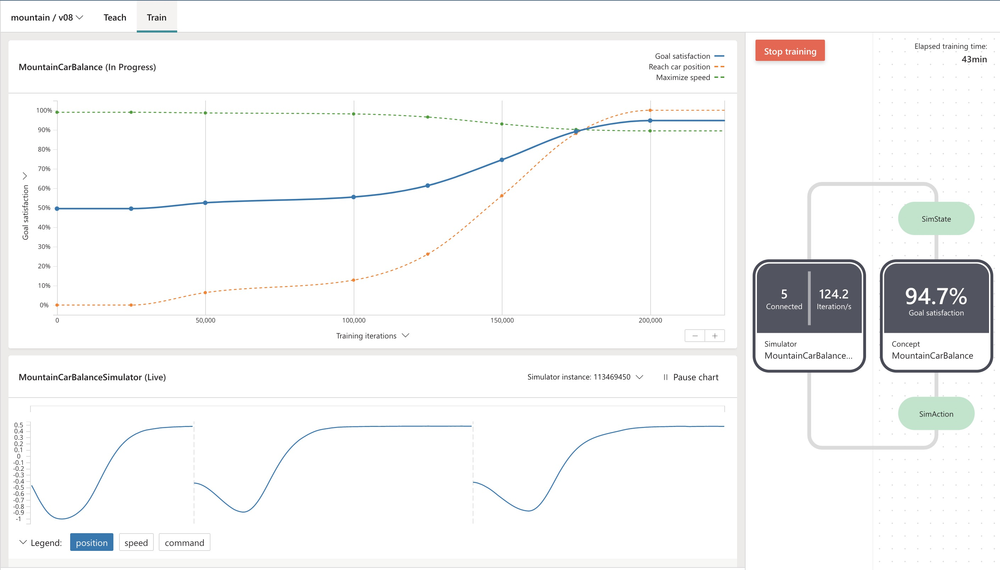
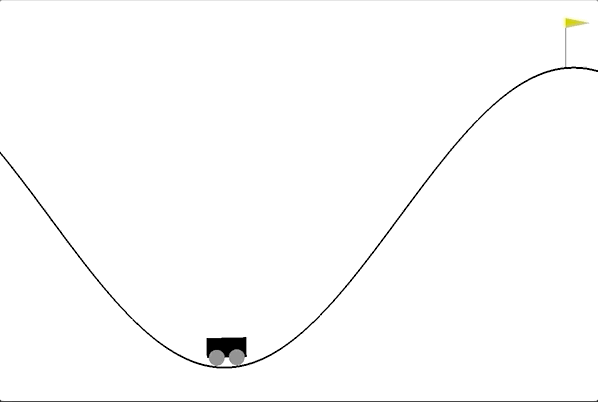
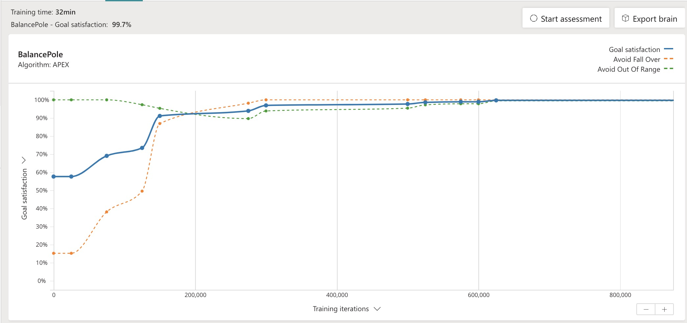
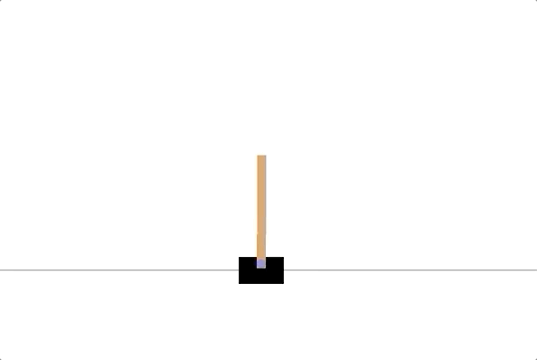
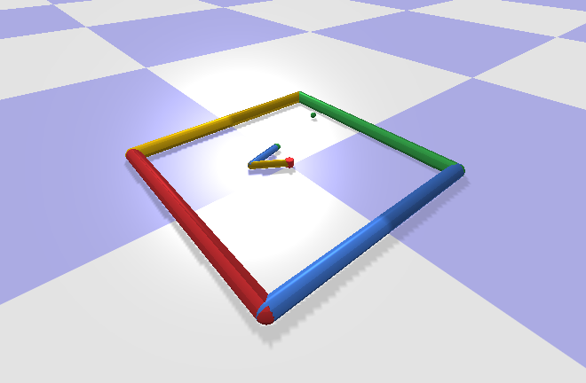

# Bonsai Gym

Bonsai Gym is an open-source library, which gives us access to OpenAI Gym standardised set of environments while using Microsoft's reinforcement learning platform Bonsai.

The repository also contains examples how to use this library to build and deploy OpenAI Gym environments to Bonsai and how to interact with the trained agent (Brain) from your code.  

## Basics

There are two basic concepts in reinforcement learning: the environment (namely, the outside world) and the agent (the algorithm you are writing). The agent sends actions to the environment, and the environment replies with observations and rewards (that is, a score).

OpenAI Gym is a toolkit for developing simulations and comparing reinforcement learning algorithms. The Gym open-source library gives us access to a standardised set of environments. Environments come as is with no predefined agent.

Link to Open AI environments: https://github.com/openai

Bonsai is the machine teaching service in the Autonomous Systems suite from Microsoft. It builds on innovations in reinforcement learning to simplify AI development.
We use Bonsai to create agents (brains) that control and optimise complex systems. No neural net design required.

Full documentation for Bonsai's Platform can be found at https://docs.bons.ai.

## Set-Up

You will need to create an account with Microsoft Bonsai.
Follow instructions: https://docs.microsoft.com/en-us/bonsai/guides/account-setup

Bonsai Gym requires two environment variables to be set to be able to connect to Microsoft Bonsai:

**SIM_ACCESS_KEY**. You can copy it from the Account Settings page.

**SIM_WORKSPACE**. You can find this in the URL after ***/workspaces/*** once you are logged in to the platform.

You will need to install support libraries prior to running locally.
Our environment depend on **microsoft_bonsai_api** package and on **gym_connectors** from this codebase.

```
cd connectors
pip3 install .
pip3 install microsoft_bonsai_api
```

### Building Dockerfile
To upload and use the simulator from Azure, you need to push it as a docker image to Azure Container Registry.

Clone the repo and go into the created folder and select an environment, e.g:

```
cd ./envs/classic_controls/Pendulum
```

From the root of the selected environment run:

```
docker build -t <IMAGE_NAME> -f Dockerfile ../../../
```

### Push to ACR
Run the following code to push to ACR:

```
az login
az acr login --subscription 09ad80b2-f9eb-414d-991f-0bcdec1616f7 --name bonsaitest4
docker tag <IMAGE_NAME> <ACR_REGISTRY_NAME>.azurecr.io/bonsai/<IMAGE_NAME>
docker push <ACR_REGSITRY_NAME>.azurecr.io/bonsai/<IMAGE_NAME>
```

### Create Simulator in Bonsai
Once you have pushed your docker image to ACR, you can create a simulator by clicking ***Add Sim*** from the left hand side navigation menu. Enter the ACR URL of the image and name it.

### Create Brain in Bonsai
You can create a brain by clicking ***Create brain*** from the left hand side navigation menu. Select ***Empty Brain***, add a name and after it has been created, copy the contents of the .ink file from the selected environment (folder) and paste them to the ***Teach*** section of the brain. Click the train button and from the presented list select the simulator you have created in the previous step.

### Running Local Agent
When you are satisfied with the training progress, stop the training and export the brain.
Run the presented code to download the exported docker image locally.

Start the agent.py located on the root of your selected environment.
The Open AI visualiser of your selected environment will start and you will see how well your trained brain 'behaves'.

## Environments

We have developed few working examples and we aim to expand this list continuously by adding new environments from different physics engines.
As with every problem, there are more than just one way to solve or achieve satisfactory results.
We are open to suggestions and we encourage code contribution.

Inside on each environment folder we have created an agent that can run locally to communicate with the exported Bonsai brain (running on Docker) and is rendering the simulation using Open AI environment.

### Classic Controls

A collection of control theory problems from the classic RL literature.

#### 1. Inverted Pendulum

The inverted pendulum swing-up problem is a classic problem in the control literature. In this version of the problem, the pendulum starts in a random position, and the goal is to swing it up so it stays upright.

We have trained the agent using a reward function, although a goal statement produced equally good results.

Reward function:
```
function GetReward(State: SimState, Action: SimAction) {
    var cmd = Action.command   #the value of the last command
    var theta = Math.ArcCos(State.cos_theta)   
    var cost = ((((theta + Math.Pi) % (2 * Math.Pi)) - Math.Pi) ** 2) + 0.1 * (State.angular_velocity ** 2) + 0.001 * (cmd ** 2)

    return -cost
}
```
Alternative Goal statement:
```
goal (State: SimState) {
    drive `upwards`:
        State.cos_theta in Goal.Range(0.707, 1.0)
}
```

- Bonsai training output:


- Exported agent (brain) performance:


#### 2. Mountain Car

A car is on a one-dimensional track, positioned between two "mountains". The goal is to drive up the mountain on the right; however, the car's engine is not strong enough to scale the mountain in a single pass. Therefore, the only way to succeed is to drive back and forth to build up momentum.

The environment appeared first in Andrew Moore's PhD Thesis (1990).

We have trained the agent using two  goal statements.

```
goal (State: SimState) {
    reach `car position`:
        State.position in Goal.RangeAbove(0.5)  
    maximize `speed`:
        Math.Abs(State.speed) in Goal.Range(0, 0.07)      
}
```

- Bonsai training output:



- Exported agent (brain) performance:



#### 3. Cart Pole

A pole is attached by an un-actuated joint to a cart, which moves along
a frictionless track. The pendulum starts upright, and the goal is to
prevent it from falling over by increasing and reducing the cart's
velocity.

This environment corresponds to the version of the cart-pole problem
described by Barto, Sutton, and Anderson

We have trained the agent using two  goal statements.

```
goal (State: SimState) {
    avoid `Fall Over`:
        Math.Abs(State.pole_angle) in Goal.RangeAbove(0.15)
    avoid `Out Of Range`:
        Math.Abs(State.cart_position) in Goal.RangeAbove(1.4)
}
```

- Bonsai training output:



- Exported agent (brain) performance:



### PyBullet

Bullet is a physics engine which simulates collision detection, soft and rigid body dynamics.

#### 1. Reacher
**Coming Soon!**


