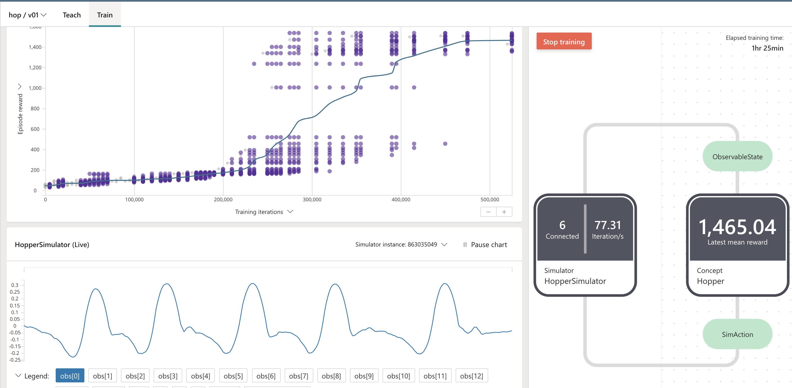
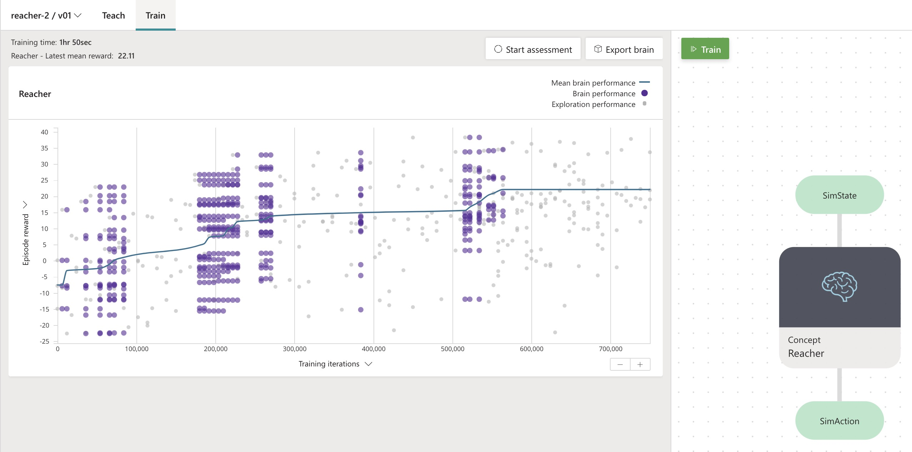

## PyBullet

Bullet is a physics engine which simulates collision detection, soft and rigid body dynamics.

PyBullet Gymperium is an open-source implementation of the OpenAI Gym MuJoCo environments for use with the OpenAI Gym Reinforcement Learning Research Platform in support of open research.

### 1. Hopper

Make a two-dimensional one-legged robot hop forward as fast as possible.
The robot model is based on work by Erez, Tassa, and Todorov.

T Erez, Y Tassa, E Todorov, "Infinite Horizon Model Predictive Control for Nonlinear Periodic Tasks", 2011.

We have trained the agent by reusing the reward function defined in pybullet-gym and amended the PPO algorithm parameters.

```
algorithm {
    Algorithm: "PPO",
    BatchSize : 3000,
    PolicyLearningRate:0.001
}

reward GetReward

training {
    EpisodeIterationLimit: 300
}
lesson walking{
    scenario {
        episode_iteration_limit: 300
    }
}

function GetReward(State: SimState, Action: SimAction) {
    return State.rew
}    
```

- Bonsai training output:



- Exported agent (brain) performance:


### 2. Reacher

Make a 2D robot reach to a randomly located target.

We have trained the agent by getting the reward function defined in pybullet-gym and amended the PPO algorithm parameters.

```
algorithm {
    Algorithm: "PPO",
    BatchSize : 10000,
    PolicyLearningRate:0.0001
}
reward GetReward

training {
    EpisodeIterationLimit: 200
}
lesson walking{
    scenario {
        episode_iteration_limit: 200
    }
}
```

- Bonsai training output:



- Exported agent (brain) performance:


### 3. Half Cheetah

Make a 2D cheetah robot run.

We have trained the agent by adjusting the reward function defined in pybullet-gym and amended the PPO algorithm parameters.

```
function GetReward(State: SimState, Action: SimAction) {
    # electicity_cost: cost for using motors -- this parameter should be carefully tuned against reward for making progress
    var electricity = -0.55
    var stall_torque_cost = -0.01
    var a1 = Math.Abs(Action.j1 * State.joint_speeds[0])
    var a2 = Math.Abs(Action.j2 * State.joint_speeds[1])
    var a3 = Math.Abs(Action.j3 * State.joint_speeds[2])
    var a4 = Math.Abs(Action.j4 * State.joint_speeds[3])
    var a5 = Math.Abs(Action.j5 * State.joint_speeds[4])
    var a6 = Math.Abs(Action.j6 * State.joint_speeds[5])

    var electricity_cost =  ((a1 + a2 + a3 + a4 + a5 + a6) / 6)
    electricity_cost = (electricity * electricity_cost) + (stall_torque_cost * ((Action.j1 * Action.j1 + Action.j2 * Action.j2 + Action.j3 * Action.j3 + Action.j4 * Action.j4 + Action.j5 * Action.j5 + Action.j6 * Action.j6) / 6))

    var joints_at_limit_cost = -0.01 * State.joints_at_limit
    var rew = State.progress + electricity_cost + joints_at_limit_cost

    return rew
}
```

- Bonsai training output:


- Exported agent (brain) performance:

